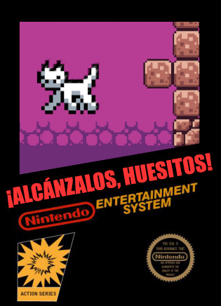

# ¡Alcánzalos, Huesitos!

## Huesitos se ha perdido. Ayúdalo a encontrar el único pescado que tiene de comida.

### Juega a ¡Alcánzalos, Huesitos! [aquí](https://www.autumn64.xyz/huesitos.html).

### Descripción

¡Alcánzalos, Huesitos! es un juego realizado como participación en el Foro Nacional de Ingeniería de UVM 2024. Hecho en Godot y utilizando herramientas libres, trata de replicar al máximo la estética y experiencia de los juegos de 8 bits de los años 80.

Este juego es un trabajo en progreso. ¡Poco a poco agregaremos más características!

### Directrices de contribuciones.

Si desea contribuir, por favor haga un fork de este repositorio, y cree una [pull request](https://codeberg.org/Autumn64/alcanzalos_huesitos/pulls) con sus propuestas. Tiene permitido modificar y/o redistribuir todo el código de este repo, siempre y cuando lo haga acatando los términos estipulados en la [Licencia Pública General Affero de GNU versión 3](./COPYING) o cualquier versión superior.

### Cómo compilar

Dado que ¡Alcánzalos, Huesitos! es un juego hecho en Godot, basta con abrir su archivo de proyecto
para poder modificarlo y compilarlo. Se puede compilar para cualquier plataforma, pero en este momento
no se cuenta con soporte para pantallas táctiles.

### Información extra

Muchísimas gracias a todas y todos nuestros [contribuyentes](https://codeberg.org/Autumn64/alcanzalos_huesitos/activity/yearly).

#### Todo el código en este repositorio está bajo la [Licencia Pública General Affero de GNU v3 o superior](./LICENSE), con algunas librerías y módulos pudiendo poseer distintas licencias permisivas compatibles con la licencia principal del proyecto. Los tiles, sprites y escenarios están bajo licencia CC BY-NC-SA, mientras que la música está bajo licencia CC BY. Este programa está destinado a su distribución para propósitos no comerciales, y ni la propietaria del proyecto ni sus colaboradores son responsables del uso que cualquiera fuera de éste pueda dar al software proporcionado y a sus insumos.

#### All the code in this repository is licensed under the [GNU Affero General Public License version 3 or later](./LICENSE), with some libraries and modules that may be under different permissive licenses compatible with the main project's license. The tiles, sprites and scenarios are licensed by the CC BY-NC-SA, while the music is under the CC BY license. This program is meant to be distributed for non-commercial purposes, and neither this project's owner nor its contributors are responsible for the use anyone outside of it may give to the software provided and its assets.